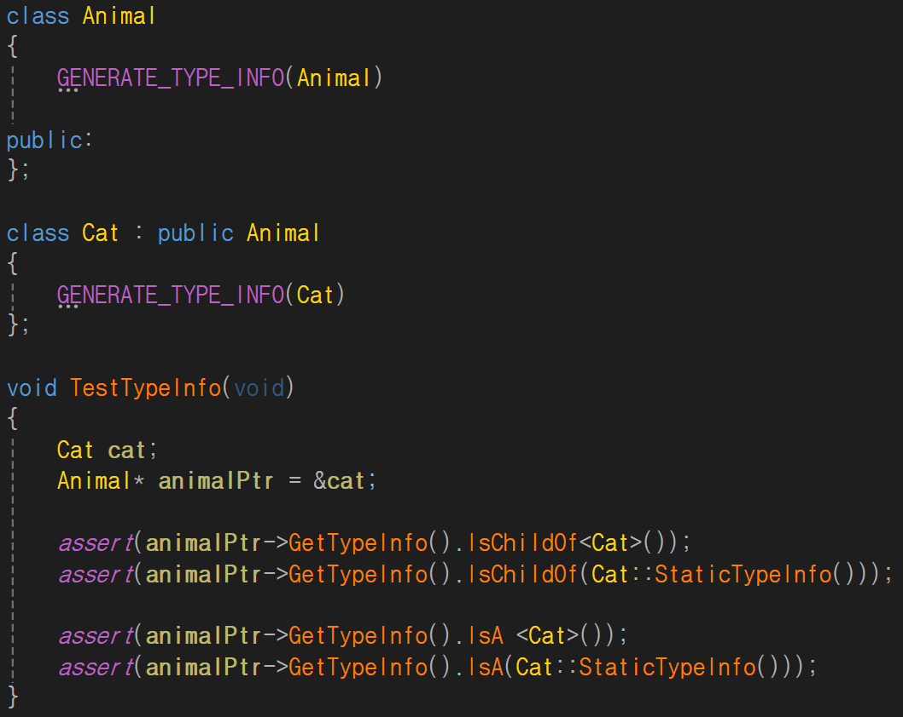
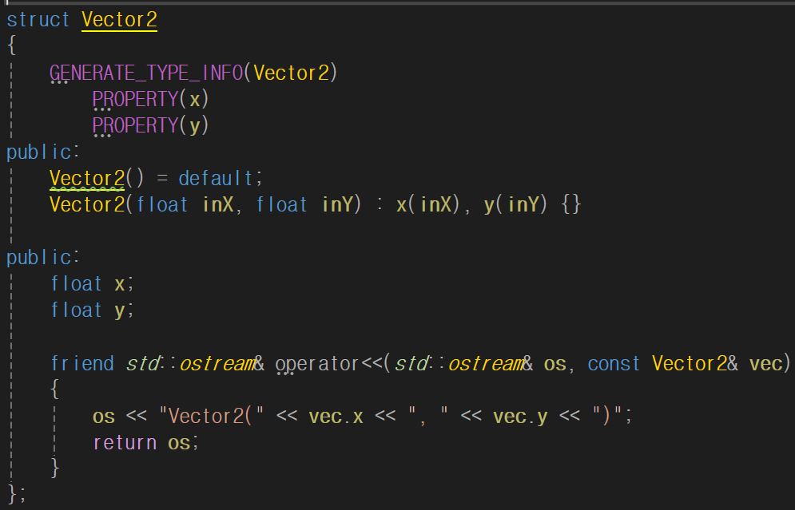
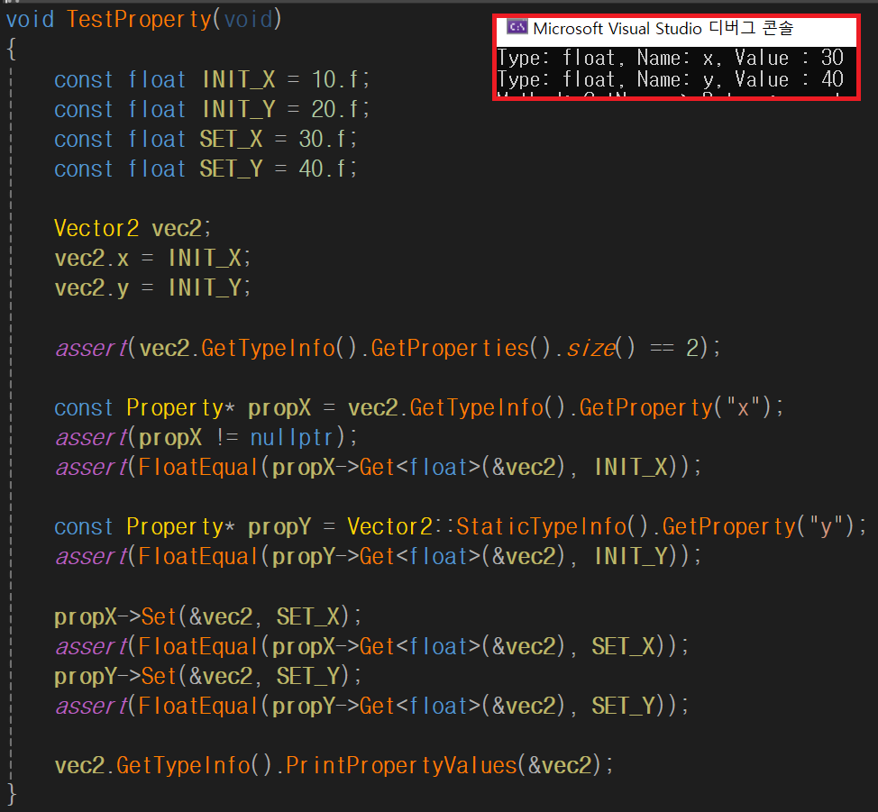
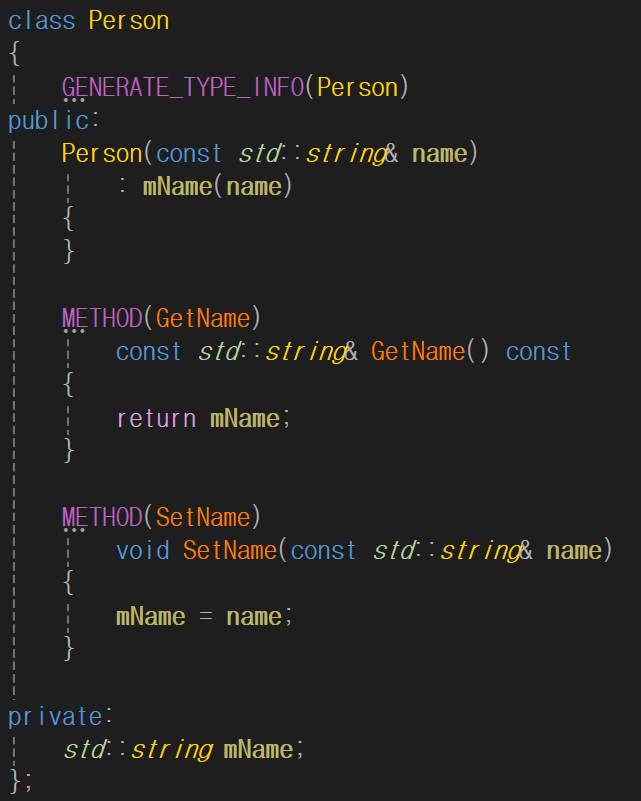
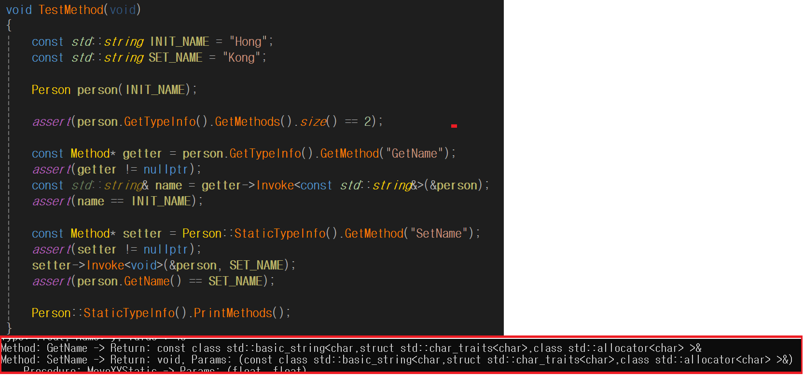
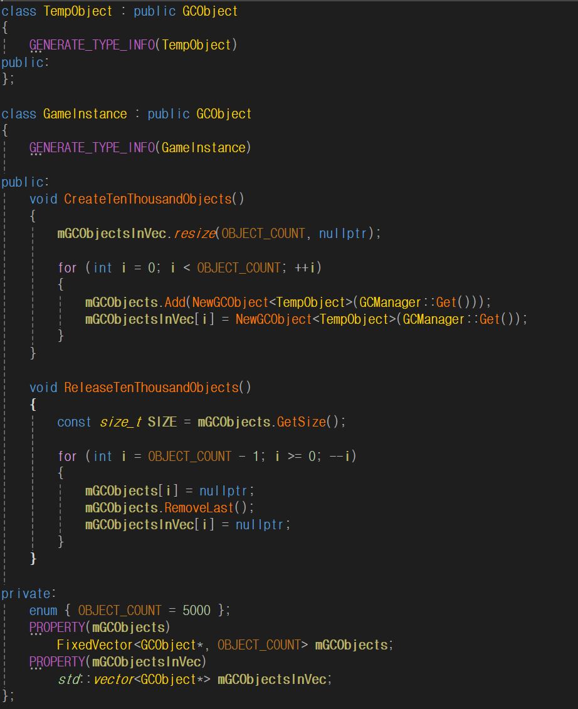
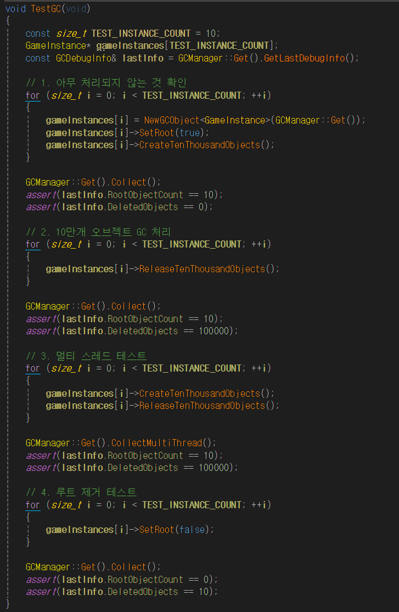
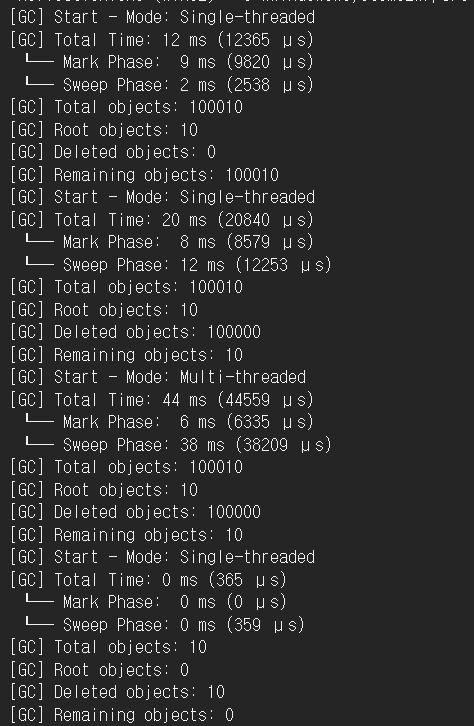
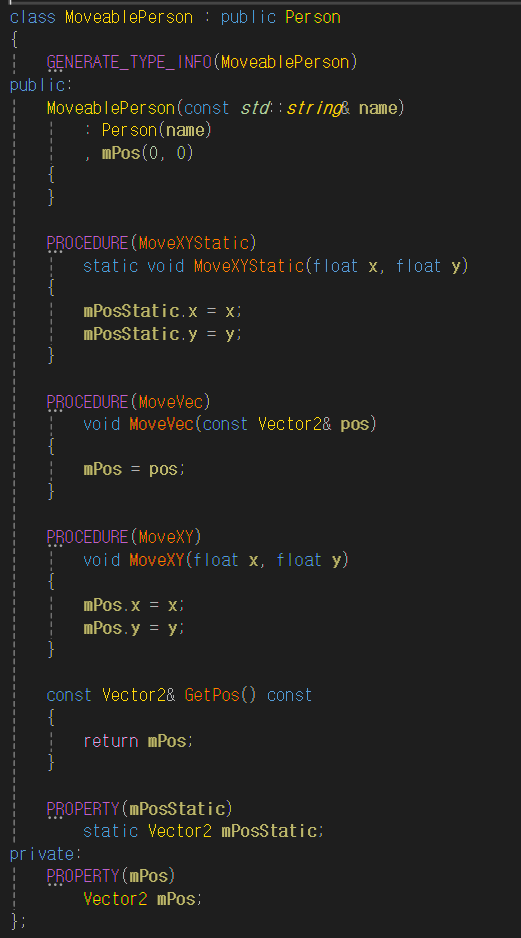
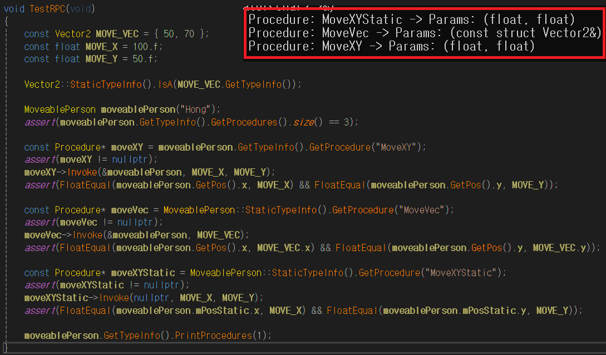

# 리플렉션과 가비지 컬렉션 개요

## 🪞 리플렉션(Reflection)이란?

리플렉션은 **프로그램이 실행 중에 자신의 구조나 타입 정보를 조회하고 조작할 수 있도록 하는 기술**입니다.  
클래스, 변수, 함수 등의 메타데이터를 생성하고, 이를 기반으로 객체를 생성하거나, 속성 값을 읽고 쓰거나, 메서드를 호출할 수 있습니다.

---

## ❓ 왜 리플렉션이 필요한가?

리플렉션은 **모듈 간 결합도를 낮추고, 유연한 구조를 만들기 위해** 사용됩니다.

게임 엔진에서는 **엔진 모듈이 게임 모듈의 구조를 알지 못한 채** 해당 기능을 사용해야 하는 경우가 많습니다.  
이러한 상황에서 리플렉션은 런타임에 메타데이터를 통해 구조를 조회하고 제어할 수 있도록 도와줍니다.

이처럼 범용적으로 설계된 하위 모듈은이 상위 모듈의 세부 정보를 알 수 없는 경우,  
**객체 구조에 대한 메타데이터를 전달받아 이를 기반으로 처리하는 방식**은 일반적입니다.

---

## 🗑️ 가비지 컬렉터(Garbage Collector)란?

가비지 컬렉터는 **더 이상 사용되지 않는 객체를 자동으로 감지하고 메모리에서 해제해주는 시스템**입니다.  
프로그래머가 객체를 직접 소멸시키지 않아도 되어, 메모리 누수나 이중 해제와 같은 오류를 방지할 수 있습니다.

---

## ❓ 왜 가비지 컬렉터가 필요한가?

동적으로 생성된 객체는 명확한 생명 주기 관리가 어렵고, 협업 환경에서는 더욱 복잡한 문제가 발생할 수 있습니다.  
이러한 상황에서 가비지 컬렉터는 다음과 같은 장점을 제공합니다:

- **자동 메모리 관리**로 인한 개발 편의성 향상  
- **객체 수명 주기의 명확한 분리**로 협업 시 안정성 강화  
- **메모리 누수 및 잘못된 해제 방지**

---

# 🧪 테스트 스크린샷

아래는 리플렉션 및 가비지 컬렉션 기능의 주요 테스트 결과입니다.  
각 테스트는 핵심 개념이 실제로 동작하는지를 검증하기 위해 작성되었습니다.

---

### 🧬 상속 구조 테스트

- `Cat` 인스턴스를 `Animal*`로 참조한 후,  
  리플렉션을 통해 실제 타입(`Cat`)과 상속 관계를 정확히 판별할 수 있는지를 확인합니다.

---

### 🏷️ 프로퍼티 시스템 테스트

  

- 리플렉션을 통해 필드의 이름과 타입을 조회할 수 있으며,  
  이름 기반으로 `Get`/`Set` 함수를 호출할 수 있습니다.

---

### 🧩 메서드 등록 및 호출 테스트

  

- 리플렉션을 통해 함수의 반환형, 이름, 매개변수 타입을 조회할 수 있으며,  
  이름과 인자를 전달해 해당 함수를 런타임에 호출할 수 있습니다.

---

### 🔁 가비지 컬렉션 테스트

  
  

- 루트 객체를 기준으로 참조 그래프를 순회하여,  
  사용 중인 객체만 추적하는 **마크 앤 스윕(Mark and Sweep)** 기반 GC입니다.
- 수거 대상이 된 객체를 안전하게 식별하고 해제할 수 있음을 확인합니다.
- 현재는 멀티스레드에 대한 이해와 최적화가 부족하여,  
  멀티스레딩 사용 시 오히려 성능이 저하되는 문제가 있습니다.

---

### 🌐 RPC 테스트

  

- 리플렉션을 통해 함수의 이름과 매개변수 타입을 조회할 수 있으며,  
  문자열 기반 호출 정보와 인자를 전달하여 런타임에 함수를 실행할 수 있습니다.
- 현재는 네트워크 연동 기능은 구현되어 있지 않아,  
  원격 호출 처리는 미지원 상태입니다.

---

## 📚 참고 자료

리플렉션 시스템과 관련된 개념 및 구현에 참고한 자료들입니다.

- [A Primitive Reflection System in C++ (Part 1) – Preshing](https://preshing.com/20180116/a-primitive-reflection-system-in-cpp-part-1/)  
- [A Flexible Reflection System in C++ (Part 2) – Preshing](https://preshing.com/20180124/a-flexible-reflection-system-in-cpp-part-2/)  
- [[2019]언리얼 엔진을 통해 살펴보는 리플렉션과 가비지 컬렉션](https://www.youtube.com/watch?v=VpEe9DbcZIs)  
- [슬라이드쉐어: C++20 메타프로그래밍과 리플렉션 개념 정리](https://www.slideshare.net/slideshow/c20-251161090/251161090)  
