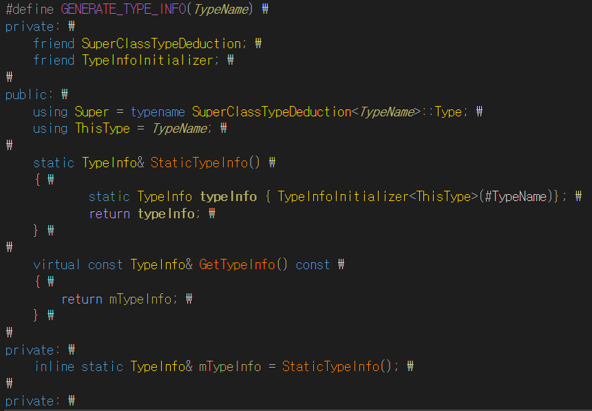
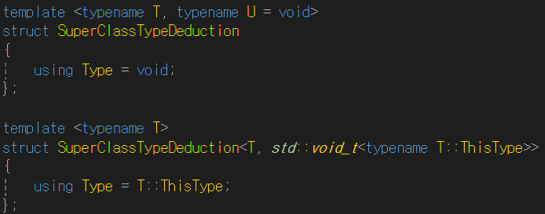
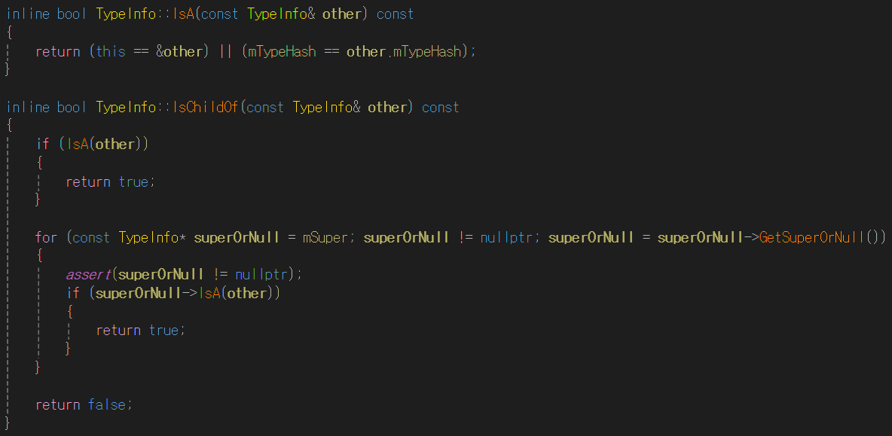
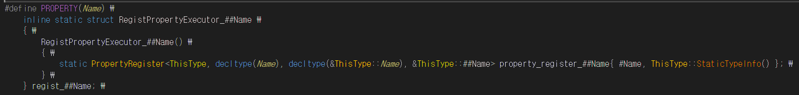
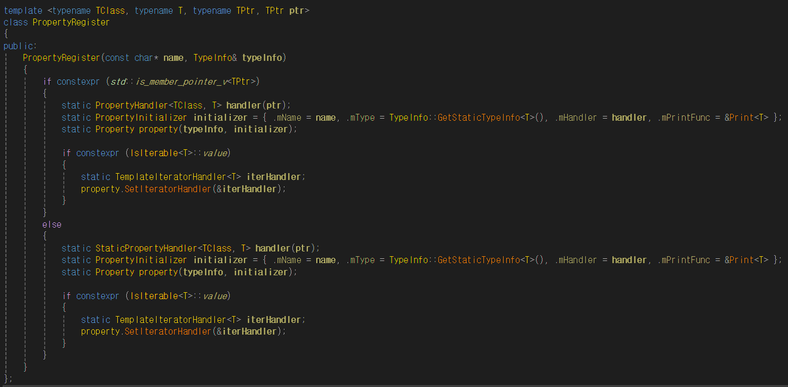
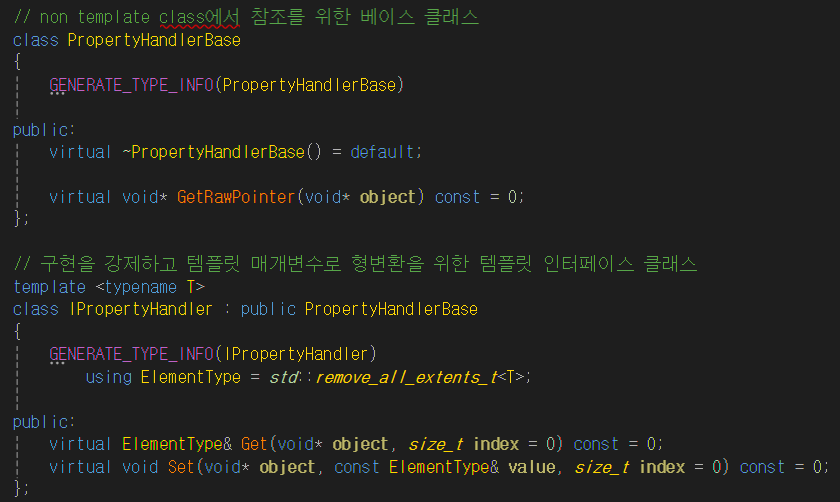
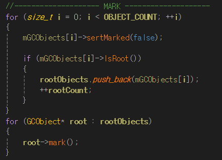
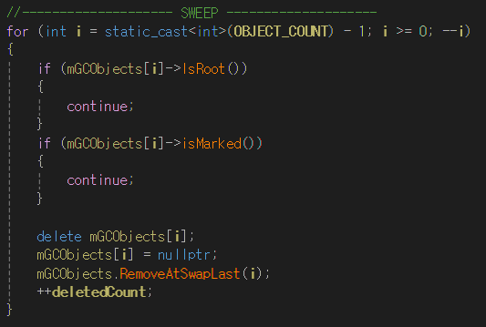
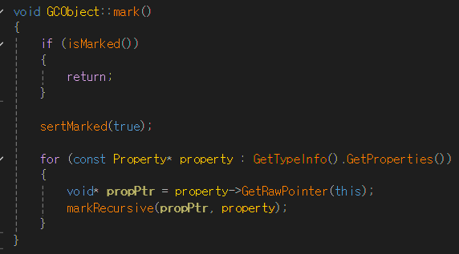
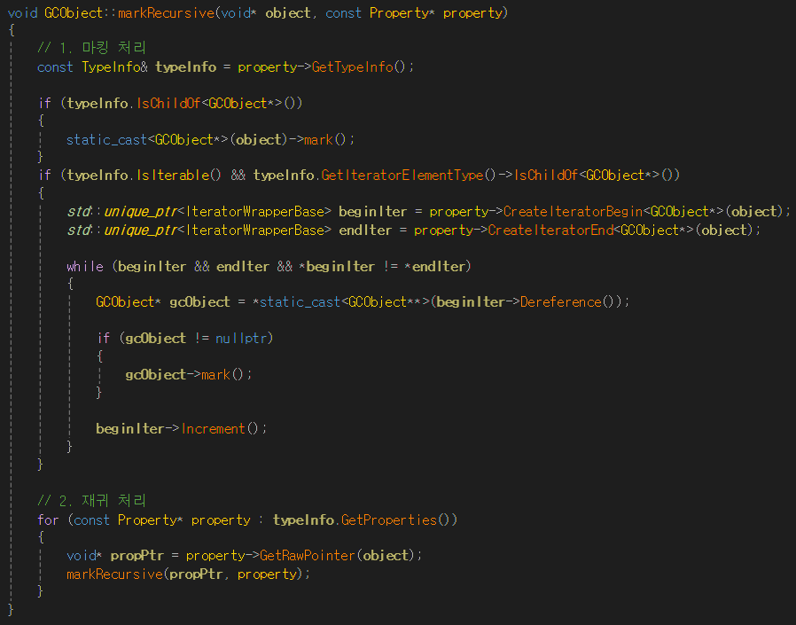

# C++ 리플렉션 / GC 시스템

---

## 1. 개념 설명

### 리플렉션(Reflection)이란?

리플렉션은 **프로그램이 실행 중에 자신의 구조나 타입 정보를 조회하고 조작할 수 있도록 하는 기술**입니다.  
클래스, 변수, 함수 등의 **메타데이터를 생성**하고, 이를 기반으로 객체를 생성하거나, 속성 값을 읽고 쓰거나, 메서드를 호출할 수 있습니다.

### 리플렉션이 필요한 이유

리플렉션은 **모듈 간 결합도를 낮추고 유연한 구조를 만들기 위해** 사용됩니다.

게임 엔진에서는 **엔진 모듈이 게임 모듈의 구조를 알지 못한 채** 해당 기능을 사용해야 하는 경우가 많습니다.  
이러한 상황에서 리플렉션은 **런타임에 메타데이터를 통해 구조를 조회하고 제어**할 수 있도록 도와줍니다.

이처럼 **범용적으로 설계된 하위 모듈이 상위 모듈의 세부 정보를 알 수 없는 경우**,  
**객체 구조에 대한 메타데이터를 전달받아 이를 기반으로 처리하는 방식**은 일반적입니다.

### 가비지 컬렉터(Garbage Collector)란?

가비지 컬렉터는 **더 이상 사용되지 않는 객체를 자동으로 감지하고 메모리에서 해제**해주는 시스템입니다.  
프로그래머가 객체를 직접 소멸시키지 않아도 되어, **메모리 누수나 이중 해제와 같은 오류를 방지**할 수 있습니다.

### 가비지 컬렉터가 필요한 이유

동적으로 생성된 객체는 **명확한 생명 주기 관리가 어렵고**, 협업 환경에서는 더욱 복잡한 문제가 발생할 수 있습니다.  
이러한 상황에서 가비지 컬렉터는 다음과 같은 장점을 제공합니다:

- **자동 메모리 관리**로 인한 개발 편의성 향상  
- **객체 수명 주기의 명확한 분리**로 협업 시 안정성 강화  
- **메모리 누수 및 잘못된 해제 방지**

---

## 2. 리플렉션 시스템 구조

### 타입 정보 (TypeInfo)

타입 정보는 클래스 자체에 어떤 메타데이터가 있는지를 나타냅니다. 현재 구현에서는 다음과 같은 정보를 포함합니다:

- 상속 관계
- 프로퍼티, 메서드, 프로시저 목록
- 포인터 여부
- 배열 여부
- 이터레이터 가능 여부

  

타입 정보 매크로는 현재 클래스의 `ThisType`을 선언하기 전에, 부모 클래스로부터 선언된 `ThisType`을 통해 부모 타입 정보를 취득합니다.  
부모 타입이 존재하지 않을 경우, 부모 타입은 `void`로 설정됩니다.

매크로는 `static` 지역 변수로 `TypeInfo`를 생성하며, `inline static`으로 선언된 멤버를 통해 실행 시점에 곧바로 초기화되고 중복 생성이 방지됩니다.  
이렇게 획득한 참조를 통해 클래스 타입과 인스턴스 모두에서 `TypeInfo`에 접근할 수 있도록 다형적인 접근 인터페이스를 제공합니다.
이때 `inline static` 멤버는 클래스 정의 내부에서 초기화할 수 있으며 외부에 따로 정의할 필요가 없습니다.

상속 구조는 `IsA` 함수를 통해 정적으로 정의된 두 `TypeInfo` 인스턴스의 주소를 비교하여 판별됩니다.  
단, 다른 DLL 간에서는 동일한 `TypeInfo`라도 인스턴스 주소가 다르므로, 해시 값을 추가로 비교하여 동일 타입 여부를 확인합니다.  
`IsChildOf`는 상속 관계 확인을 위해 부모 `TypeInfo`가 유효할 때까지 `IsA`를 반복 호출합니다.

---

### 프로퍼티 정보 (Property)

프로퍼티는 전달된 포인터 타입에서 값을 출력하거나, `Get`/`Set`을 통한 프로퍼티 수정,  
`GetAt`/`SetAt`을 통한 배열 접근, `CreateIteratorBegin`/`End`를 통한 베이스 이터레이터 반환 등의 기능을 제공합니다.

프로퍼티 매크로는 `TypeInfo`와 매크로에 전달된 멤버 변수 이름으로부터 클래스 타입, 변수 타입, 변수 포인터 타입, 변수의 주소를 추출합니다.

`PropertyRegister`는 프로퍼티 객체를 생성하는 데 필요한 정보를 기반으로 `Property` 객체를 `static`으로 생성합니다.  
해당 멤버가 `static`인지 여부에 따라 `Get`/`Set` 처리를 담당할 핸들러 클래스를 분기 처리하고, 순회 가능한 경우에는 `IterHandler`를 할당합니다.

핸들러 클래스는 런타임 다형성을 제공하는 추상 기반 클래스와, 컴파일 타임 다형성을 위한 템플릿 중간 클래스들로 구성됩니다.  
이 구조를 통해 T 타입에 대한 유효성 검사와 유연한 확장성을 동시에 확보할 수 있습니다.

---

### 메서드 정보 (Method)

메서드는 반환 타입, 매개변수 목록, 함수 이름 등을 관리하며, 출력 및 호출 기능을 수행할 수 있습니다.

처리 방식은 대부분 프로퍼티와 유사하지만, 메서드는 호출 시 반환 타입과 매개변수 타입에 대한 타입 검사가 선행된 후 호출이 이루어집니다.

---

### 프로시저 정보 (Procedure)

프로시저는 메서드와 동일한 방식으로 처리되지만, 반환값이 없는 함수인 경우를 별도로 분리하여 관리하기 위해 도입되었습니다.

---

### 가비지 컬렉션 시스템 (GC)

가비지 컬렉터는 Mark-and-Sweep 방식으로 동작하기 위해, 전역적으로 GC의 대상이 되는 객체(`GCObject`)와  
이 객체들에 대한 참조를 관리하는 `GCManager`로 구성됩니다.

개체 생성은 `GCUtility.h`에 정의된 `NewGCObject`를 통해 이루어지며,  
싱글톤으로 선언된 `GCManager` 객체를 전달하면, 내부에서 객체를 동적으로 생성한 뒤  
해당 객체를 `GCManager`에 등록 대상으로 등록시켜줍니다.

`GCManager`에서 `Collect()`를 호출하면 다음과 같은 절차가 수행됩니다:

1. GCObject들이 저장된 배열을 순회하며 모든 객체의 마크 여부를 초기화합니다.  
2. 루트로 등록된 오브젝트들을 얻어온 뒤, 각각에 대해 `mark()`를 호출하여 참조 그래프를 따라 탐색합니다.  
3. 스윕 단계에서는 루트가 아니며 마킹되지 않은 객체들을 실제로 해제합니다.

`GCObject`의 마크 단계에서는 자신이 가지고 있는 **모든 프로퍼티를 순회**하고,  
해당 프로퍼티의 타입이 다음 중 하나인 경우에 대해 `mark()`를 **전파**합니다:

- `GCObject*` 포인터 타입
- 이터레이션 가능한 타입이면서 요소 타입이 `GCObject`인 경우

이러한 타입 판별은 리플렉션 기반의 `Property` 메타데이터에서 `TypeInfo`를 통해 이루어지며,  
이터러블 타입인 경우에는 이터레이터를 통해 각각의 요소를 순회하여 GCObject인 경우에만 재귀적으로 마크를 전파합니다.

이 구조는 리플렉션 메타데이터를 기반으로 GC 대상 여부를 동적으로 판단할 수 있게 하며,  
직접적인 타입 종속 없이 일반화된 런타임 메모리 관리를 가능하게 합니다.

---

## 3. 기능 테스트 스크린샷

아래는 리플렉션 및 가비지 컬렉션 시스템의 주요 테스트 결과입니다.

### 상속 구조 테스트

- `Cat` 인스턴스를 `Animal*`로 참조한 후,  
  리플렉션을 통해 **실제 타입(`Cat`)과 상속 관계를 판별**할 수 있는지 확인합니다.

### 프로퍼티 시스템 테스트

  

- 필드의 이름과 타입을 조회할 수 있으며,  
  **이름 기반으로 `Get`/`Set`을 호출**할 수 있습니다.

### 메서드 등록 및 호출 테스트

  

- 함수의 이름, 반환형, 매개변수 타입을 조회할 수 있고,  
  **런타임에 이름과 인자를 전달해 함수 호출**이 가능합니다.

### 가비지 컬렉션 테스트

  
  

- **Mark and Sweep** 방식의 GC로, 루트 객체를 기준으로 참조 그래프를 순회하며 사용 중인 객체만 추적합니다.
- 수거 대상 객체를 **정확히 식별 및 해제**할 수 있음을 확인합니다.
- 현재는 **멀티스레드 환경에서 성능 저하** 이슈가 존재합니다.

### RPC 테스트

  

- 함수 이름과 매개변수 타입을 기반으로,  
  **문자열 형태의 호출 정보로 런타임 함수 실행**이 가능합니다.
- 현재는 **네트워크 연동 미지원** 상태입니다.

---

## 4. 참고 자료

- [A Primitive Reflection System in C++ (Part 1) – Preshing](https://preshing.com/20180116/a-primitive-reflection-system-in-cpp-part-1/)  
- [A Flexible Reflection System in C++ (Part 2) – Preshing](https://preshing.com/20180124/a-flexible-reflection-system-in-cpp-part-2/)  
- [[2019] 언리얼 엔진을 통해 살펴보는 리플렉션과 가비지 컬렉션](https://www.youtube.com/watch?v=VpEe9DbcZIs)  
- [슬라이드쉐어: C++20 메타프로그래밍과 리플렉션 개념 정리](https://www.slideshare.net/slideshow/c20-251161090/251161090)  
- [cppreference: static 및 inline static 설명](https://en.cppreference.com/w/cpp/language/static)
